# Design Document: LLM Provider Abstraction

## Overview

The LLM Provider Abstraction is a .NET class library that provides a unified interface for interacting with Large Language Model (LLM) providers. This PoC implementation supports two provider types:

1. **Amazon Bedrock** - Cloud-based LLM service with managed models
2. **Local Providers** - Self-hosted models accessible via HTTP endpoints (e.g., Ollama, LM Studio)

The abstraction enables two primary use cases:
- **Context-based analysis**: Send context and prompts for one-time analysis
- **Chatbot sessions**: Maintain conversation history for contextual interactions

The design follows .NET conventions and uses async/await patterns throughout for optimal performance and responsiveness.

## Architecture

### High-Level Architecture

```mermaid
graph TB
    Client[.NET Application]
    Client --> ILLMProvider[ILLMProvider Interface]
    
    ILLMProvider --> BedrockProvider[BedrockProvider]
    ILLMProvider --> LocalProvider[LocalProvider]
    
    BedrockProvider --> BedrockSDK[AWS Bedrock SDK]
    LocalProvider --> HttpClient[HttpClient]
    
    BedrockSDK --> Bedrock[Amazon Bedrock]
    HttpClient --> LocalModel[Local LLM Server]
    
    Client --> SessionManager[SessionManager]
    SessionManager --> Session[Session]
    Session --> MessageHistory[(Message History)]
```



### Architectural Principles

1. **Provider Abstraction**: Common interface (`ILLMProvider`) hides provider-specific implementation details
2. **Dependency Injection Ready**: Interfaces support DI container registration
3. **Async-First**: All I/O operations use async/await to prevent blocking
4. **Separation of Concerns**: Session management is separate from provider communication
5. **Configuration-Based**: Provider selection and configuration via strongly-typed options

### Component Responsibilities

- **ILLMProvider**: Defines contract for LLM communication
- **BedrockProvider**: Implements AWS Bedrock-specific logic using AWS SDK
- **LocalProvider**: Implements HTTP-based communication for local models
- **SessionManager**: Manages conversation sessions and message history
- **Session**: Represents a single conversation thread with message storage
- **LLMConfiguration**: Strongly-typed configuration for provider setup

## Components and Interfaces

### Core Interfaces

#### ILLMProvider

```csharp
public interface ILLMProvider
{
    /// <summary>
    /// Sends a context-based analysis request to the LLM
    /// </summary>
    Task<LLMResponse> AnalyzeAsync(string context, string prompt, CancellationToken cancellationToken = default);
    
    /// <summary>
    /// Sends a message within a session context
    /// </summary>
    Task<LLMResponse> SendMessageAsync(Session session, string message, CancellationToken cancellationToken = default);
    
    /// <summary>
    /// Validates the provider configuration and connectivity
    /// </summary>
    Task<ValidationResult> ValidateAsync(CancellationToken cancellationToken = default);
}
```

#### ISessionManager

```csharp
public interface ISessionManager
{
    /// <summary>
    /// Creates a new conversation session
    /// </summary>
    Session CreateSession(string? sessionId = null);
    
    /// <summary>
    /// Retrieves an existing session by ID
    /// </summary>
    Session? GetSession(string sessionId);
    
    /// <summary>
    /// Retrieves all messages in a session
    /// </summary>
    IReadOnlyList<Message> GetSessionHistory(string sessionId);
}
```

### Core Classes

#### LLMConfiguration

```csharp
public class LLMConfiguration
{
    public ProviderType ProviderType { get; set; }
    public string ModelIdentifier { get; set; } = string.Empty;
    
    // Cloud provider settings
    public string? AccessKey { get; set; }
    public string? SecretKey { get; set; }
    public string? Region { get; set; }
    
    // Local provider settings
    public string? Endpoint { get; set; }
    
    // Optional settings
    public int TimeoutSeconds { get; set; } = 30;
    public int MaxRetries { get; set; } = 3;
}

public enum ProviderType
{
    Bedrock,
    Local
}
```

#### Session

```csharp
public class Session
{
    public string SessionId { get; }
    public DateTime CreatedAt { get; }
    public DateTime LastAccessedAt { get; private set; }
    
    private readonly List<Message> _messages = new();
    
    public IReadOnlyList<Message> Messages => _messages.AsReadOnly();
    
    public void AddMessage(Message message)
    {
        _messages.Add(message);
        LastAccessedAt = DateTime.UtcNow;
    }
}
```

#### Message

```csharp
public class Message
{
    public string Content { get; }
    public MessageRole Role { get; }
    public DateTime Timestamp { get; }
    
    public Message(string content, MessageRole role)
    {
        Content = content;
        Role = role;
        Timestamp = DateTime.UtcNow;
    }
}

public enum MessageRole
{
    User,
    Assistant,
    System
}
```

#### LLMResponse

```csharp
public class LLMResponse
{
    public bool Success { get; }
    public string? Content { get; }
    public LLMError? Error { get; }
    public Dictionary<string, object> Metadata { get; }
    
    public static LLMResponse CreateSuccess(string content, Dictionary<string, object>? metadata = null)
    {
        return new LLMResponse(true, content, null, metadata ?? new());
    }
    
    public static LLMResponse CreateError(LLMError error)
    {
        return new LLMResponse(false, null, error, new());
    }
}
```

#### LLMError

```csharp
public class LLMError
{
    public ErrorType Type { get; }
    public string Message { get; }
    public Exception? InnerException { get; }
    
    public LLMError(ErrorType type, string message, Exception? innerException = null)
    {
        Type = type;
        Message = message;
        InnerException = innerException;
    }
}

public enum ErrorType
{
    ValidationError,
    ConnectionError,
    AuthenticationError,
    RateLimitError,
    ProviderError,
    UnknownError
}
```

### Provider Implementations

#### BedrockProvider

```csharp
public class BedrockProvider : ILLMProvider
{
    private readonly AmazonBedrockRuntimeClient _client;
    private readonly string _modelId;
    
    public BedrockProvider(LLMConfiguration config)
    {
        // Initialize AWS SDK client with credentials and region
        var credentials = new BasicAWSCredentials(config.AccessKey, config.SecretKey);
        var regionEndpoint = RegionEndpoint.GetBySystemName(config.Region ?? "us-east-1");
        
        _client = new AmazonBedrockRuntimeClient(credentials, regionEndpoint);
        _modelId = config.ModelIdentifier;
    }
    
    public async Task<LLMResponse> AnalyzeAsync(string context, string prompt, CancellationToken cancellationToken = default)
    {
        // Format request for Bedrock Converse API
        // Handle response and error mapping
    }
    
    public async Task<LLMResponse> SendMessageAsync(Session session, string message, CancellationToken cancellationToken = default)
    {
        // Convert session history to Bedrock message format
        // Send request with conversation context
    }
    
    public async Task<ValidationResult> ValidateAsync(CancellationToken cancellationToken = default)
    {
        // Test connectivity and credentials
    }
}
```

#### LocalProvider

```csharp
public class LocalProvider : ILLMProvider
{
    private readonly HttpClient _httpClient;
    private readonly string _endpoint;
    private readonly string _modelId;
    
    public LocalProvider(LLMConfiguration config, HttpClient httpClient)
    {
        _httpClient = httpClient;
        _endpoint = config.Endpoint ?? throw new ArgumentException("Endpoint required for local provider");
        _modelId = config.ModelIdentifier;
        
        _httpClient.Timeout = TimeSpan.FromSeconds(config.TimeoutSeconds);
    }
    
    public async Task<LLMResponse> AnalyzeAsync(string context, string prompt, CancellationToken cancellationToken = default)
    {
        // Format request for OpenAI-compatible API
        // POST to /v1/chat/completions
    }
    
    public async Task<LLMResponse> SendMessageAsync(Session session, string message, CancellationToken cancellationToken = default)
    {
        // Convert session history to OpenAI message format
        // Send request with conversation context
    }
    
    public async Task<ValidationResult> ValidateAsync(CancellationToken cancellationToken = default)
    {
        // Test endpoint connectivity
    }
}
```

#### SessionManager

```csharp
public class SessionManager : ISessionManager
{
    private readonly ConcurrentDictionary<string, Session> _sessions = new();
    
    public Session CreateSession(string? sessionId = null)
    {
        sessionId ??= Guid.NewGuid().ToString();
        var session = new Session(sessionId);
        _sessions.TryAdd(sessionId, session);
        return session;
    }
    
    public Session? GetSession(string sessionId)
    {
        _sessions.TryGetValue(sessionId, out var session);
        return session;
    }
    
    public IReadOnlyList<Message> GetSessionHistory(string sessionId)
    {
        var session = GetSession(sessionId);
        return session?.Messages ?? Array.Empty<Message>();
    }
}
```

### Factory Pattern

#### LLMProviderFactory

```csharp
public class LLMProviderFactory
{
    private readonly IHttpClientFactory _httpClientFactory;
    
    public LLMProviderFactory(IHttpClientFactory httpClientFactory)
    {
        _httpClientFactory = httpClientFactory;
    }
    
    public ILLMProvider CreateProvider(LLMConfiguration config)
    {
        return config.ProviderType switch
        {
            ProviderType.Bedrock => new BedrockProvider(config),
            ProviderType.Local => new LocalProvider(config, _httpClientFactory.CreateClient()),
            _ => throw new ArgumentException($"Unsupported provider type: {config.ProviderType}")
        };
    }
}
```

## Data Models

### Message Flow

For context-based analysis:
```
User Input (context + prompt) 
  → ILLMProvider.AnalyzeAsync() 
  → Provider-specific formatting 
  → HTTP/SDK call 
  → Response parsing 
  → LLMResponse
```

For session-based chat:
```
User Input (message) 
  → Session.AddMessage(user message) 
  → ILLMProvider.SendMessageAsync(session, message) 
  → Provider-specific formatting with history 
  → HTTP/SDK call 
  → Response parsing 
  → Session.AddMessage(assistant message) 
  → LLMResponse
```

### Provider-Specific Message Formats

#### Bedrock Converse API Format

```json
{
  "modelId": "anthropic.claude-3-sonnet-20240229-v1:0",
  "messages": [
    {
      "role": "user",
      "content": [{"text": "message content"}]
    }
  ],
  "inferenceConfig": {
    "maxTokens": 2048,
    "temperature": 0.7
  }
}
```

#### Local Provider (OpenAI-Compatible) Format

```json
{
  "model": "llama2",
  "messages": [
    {
      "role": "user",
      "content": "message content"
    }
  ],
  "temperature": 0.7,
  "max_tokens": 2048
}
```

### Configuration Validation Rules

1. **ProviderType** is required
2. **ModelIdentifier** is required and non-empty
3. For **Bedrock**: AccessKey, SecretKey required; Region optional (defaults to us-east-1)
4. For **Local**: Endpoint required and must be valid URI
5. **TimeoutSeconds** must be > 0
6. **MaxRetries** must be >= 0


## Correctness Properties

A property is a characteristic or behavior that should hold true across all valid executions of a system—essentially, a formal statement about what the system should do. Properties serve as the bridge between human-readable specifications and machine-verifiable correctness guarantees.

### Property 1: Provider Creation from Valid Configuration

For any valid LLMConfiguration (with appropriate provider type, credentials/endpoint, and model identifier), creating a provider through the factory should succeed and return a provider instance of the correct type.

**Validates: Requirements 1.1, 1.2, 4.1, 4.2, 4.3, 4.4**

### Property 2: Provider Initialization with Valid Settings

For any valid provider configuration (Bedrock with credentials or Local with endpoint), initializing the provider should successfully establish connectivity without throwing exceptions.

**Validates: Requirements 1.3, 1.4**

### Property 3: Authentication and Connection Failures Return Descriptive Errors

For any authentication failure (invalid credentials, unreachable endpoint, network timeout), the provider should return an LLMResponse with Success=false and an LLMError containing a descriptive message and appropriate ErrorType.

**Validates: Requirements 1.5**

### Property 4: Context Analysis Request-Response Round Trip

For any valid context and prompt strings, sending an analysis request should return an LLMResponse, and if the provider responds successfully, the response should contain non-empty content.

**Validates: Requirements 2.1, 2.2**

### Property 5: Provider Errors Return Descriptive Messages

For any provider error response (malformed request, model not found, service error), the abstraction should return an LLMResponse with Success=false and an LLMError containing a descriptive message that includes the provider's error details.

**Validates: Requirements 2.3**

### Property 6: Session Creation Always Succeeds

For any session creation request (with or without a specified session ID), the SessionManager should return a valid Session object with a unique SessionId and empty message history.

**Validates: Requirements 3.1**

### Property 7: Message Storage Round Trip

For any Session and any Message, adding the message to the session and then retrieving the session history should include that message with the same content, role, and relative order preserved.

**Validates: Requirements 3.2, 3.4**

### Property 8: Session Context Inclusion

For any Session with existing message history, sending a new message through the provider should include all previous messages in the request payload sent to the underlying LLM provider.

**Validates: Requirements 3.3**

### Property 9: Region Configuration Propagation

For any cloud-based provider configuration with a specified region, the provider should use that region when establishing the connection to the cloud service.

**Validates: Requirements 4.5**

### Property 10: Invalid Configuration Returns Validation Error

For any invalid LLMConfiguration (missing required fields, invalid provider type, malformed endpoint URI), validation should fail and return a ValidationResult with Success=false and descriptive error messages.

**Validates: Requirements 5.1**

### Property 11: Network Errors Return Connection Error

For any network failure scenario (connection timeout, DNS resolution failure, connection refused), the provider should return an LLMResponse with ErrorType.ConnectionError and a descriptive message.

**Validates: Requirements 5.2**

### Property 12: Rate Limit Errors Return Rate Limit Error

For any rate limit response from the provider (HTTP 429, throttling exception), the provider should return an LLMResponse with ErrorType.RateLimitError and a descriptive message indicating rate limiting.

**Validates: Requirements 5.3**

### Property 13: All I/O Operations Are Async

For any method in ILLMProvider or ISessionManager that performs I/O operations (network calls, file access), the method signature should return Task or Task<T> and use async/await internally.

**Validates: Requirements 6.2**

## Error Handling

### Error Categories

The abstraction defines five primary error categories:

1. **ValidationError**: Configuration or input validation failures
2. **ConnectionError**: Network connectivity issues
3. **AuthenticationError**: Credential or authorization failures
4. **RateLimitError**: Provider throttling or quota exceeded
5. **ProviderError**: Provider-specific errors (model not found, malformed request)
6. **UnknownError**: Unexpected errors that don't fit other categories

### Error Handling Strategy

#### Configuration Validation

Validation occurs at provider creation time:

```csharp
public ValidationResult Validate(LLMConfiguration config)
{
    var errors = new List<string>();
    
    if (string.IsNullOrWhiteSpace(config.ModelIdentifier))
        errors.Add("ModelIdentifier is required");
    
    if (config.ProviderType == ProviderType.Bedrock)
    {
        if (string.IsNullOrWhiteSpace(config.AccessKey))
            errors.Add("AccessKey is required for Bedrock provider");
        if (string.IsNullOrWhiteSpace(config.SecretKey))
            errors.Add("SecretKey is required for Bedrock provider");
    }
    else if (config.ProviderType == ProviderType.Local)
    {
        if (string.IsNullOrWhiteSpace(config.Endpoint))
            errors.Add("Endpoint is required for Local provider");
        else if (!Uri.TryCreate(config.Endpoint, UriKind.Absolute, out _))
            errors.Add("Endpoint must be a valid URI");
    }
    
    return errors.Any() 
        ? ValidationResult.Failure(errors) 
        : ValidationResult.Success();
}
```

#### Network Error Handling

Network errors are caught and wrapped with descriptive messages:

```csharp
try
{
    var response = await _httpClient.PostAsync(endpoint, content, cancellationToken);
    response.EnsureSuccessStatusCode();
    // Process response
}
catch (HttpRequestException ex)
{
    return LLMResponse.CreateError(new LLMError(
        ErrorType.ConnectionError,
        $"Failed to connect to provider at {endpoint}: {ex.Message}",
        ex
    ));
}
catch (TaskCanceledException ex) when (!cancellationToken.IsCancellationRequested)
{
    return LLMResponse.CreateError(new LLMError(
        ErrorType.ConnectionError,
        $"Request to provider timed out after {_httpClient.Timeout.TotalSeconds} seconds",
        ex
    ));
}
```

#### Provider Error Mapping

Provider-specific errors are mapped to abstraction error types:

**Bedrock Error Mapping:**
- `ThrottlingException` → `ErrorType.RateLimitError`
- `ValidationException` → `ErrorType.ValidationError`
- `AccessDeniedException` → `ErrorType.AuthenticationError`
- `ResourceNotFoundException` → `ErrorType.ProviderError`
- Other exceptions → `ErrorType.UnknownError`

**Local Provider Error Mapping:**
- HTTP 429 → `ErrorType.RateLimitError`
- HTTP 401/403 → `ErrorType.AuthenticationError`
- HTTP 400 → `ErrorType.ValidationError`
- HTTP 404 → `ErrorType.ProviderError`
- HTTP 5xx → `ErrorType.ProviderError`
- Network errors → `ErrorType.ConnectionError`

#### Retry Logic

For transient errors, implement exponential backoff:

```csharp
private async Task<LLMResponse> ExecuteWithRetryAsync(
    Func<Task<LLMResponse>> operation,
    int maxRetries,
    CancellationToken cancellationToken)
{
    for (int attempt = 0; attempt <= maxRetries; attempt++)
    {
        var response = await operation();
        
        if (response.Success || !IsTransientError(response.Error))
            return response;
        
        if (attempt < maxRetries)
        {
            var delay = TimeSpan.FromSeconds(Math.Pow(2, attempt));
            await Task.Delay(delay, cancellationToken);
        }
    }
    
    return response; // Return last error after all retries exhausted
}

private bool IsTransientError(LLMError? error)
{
    return error?.Type is ErrorType.ConnectionError or ErrorType.RateLimitError;
}
```

### Error Message Guidelines

Error messages should be:
1. **Descriptive**: Explain what went wrong
2. **Actionable**: Suggest how to fix the issue when possible
3. **Contextual**: Include relevant details (endpoint, model ID, etc.)
4. **User-friendly**: Avoid exposing sensitive information or internal implementation details

Examples:
- ✅ "Failed to connect to local provider at http://localhost:11434. Ensure the server is running and accessible."
- ✅ "Rate limit exceeded for model 'claude-3-sonnet'. Please wait before retrying."
- ✅ "Invalid configuration: AccessKey is required for Bedrock provider."
- ❌ "NullReferenceException at line 42"
- ❌ "Error code: 0x80004005"

## Testing Strategy

### Dual Testing Approach

This project requires both unit testing and property-based testing to ensure comprehensive coverage:

- **Unit tests**: Verify specific examples, edge cases, error conditions, and integration points
- **Property tests**: Verify universal properties across all inputs through randomization

### Unit Testing Focus

Unit tests should cover:

1. **Specific Examples**
   - Creating a Bedrock provider with valid credentials
   - Creating a local provider with valid endpoint
   - Sending a simple analysis request
   - Creating and retrieving a session

2. **Edge Cases**
   - Empty context or prompt strings
   - Very long message content
   - Special characters in messages
   - Session with no messages
   - Concurrent session access

3. **Error Conditions**
   - Invalid configuration (missing required fields)
   - Malformed endpoint URI
   - Network timeout simulation
   - Provider error responses (404, 500, etc.)
   - Rate limit responses

4. **Integration Points**
   - SessionManager and Provider interaction
   - Factory creating correct provider types
   - Message history included in session requests

### Property-Based Testing

Property-based testing will be implemented using **Hedgehog** (a .NET property-based testing library similar to QuickCheck).

Each property test must:
- Run a minimum of 100 iterations
- Include a comment tag referencing the design property
- Use appropriate generators for test data

#### Property Test Configuration

```csharp
[Property(Tests = 100)]
public Property ValidConfigurationCreatesProvider()
{
    // Feature: llm-provider-abstraction, Property 1: Provider Creation from Valid Configuration
    return Prop.ForAll(
        ValidConfigurationGenerator(),
        config =>
        {
            var factory = new LLMProviderFactory(httpClientFactory);
            var provider = factory.CreateProvider(config);
            
            return provider != null &&
                   (config.ProviderType == ProviderType.Bedrock 
                       ? provider is BedrockProvider 
                       : provider is LocalProvider);
        });
}
```

#### Test Data Generators

Generators should produce:

**Valid Configurations:**
- Random provider types
- Valid model identifiers (from known model list)
- Valid credentials (format-correct, not necessarily working)
- Valid endpoints (well-formed URIs)
- Valid regions (from AWS region list)

**Invalid Configurations:**
- Missing required fields
- Empty strings
- Malformed URIs
- Invalid provider types

**Messages:**
- Random content (various lengths, character sets)
- All message roles
- Edge cases (empty, very long, special characters)

**Sessions:**
- Random session IDs
- Various message history lengths (0 to 100 messages)
- Mixed message roles

### Test Organization

```
LLMProviderAbstraction.Tests/
├── Unit/
│   ├── Configuration/
│   │   ├── LLMConfigurationTests.cs
│   │   └── ValidationTests.cs
│   ├── Providers/
│   │   ├── BedrockProviderTests.cs
│   │   └── LocalProviderTests.cs
│   ├── Session/
│   │   ├── SessionManagerTests.cs
│   │   └── SessionTests.cs
│   └── Factory/
│       └── LLMProviderFactoryTests.cs
├── Properties/
│   ├── ConfigurationProperties.cs
│   ├── ProviderProperties.cs
│   ├── SessionProperties.cs
│   └── ErrorHandlingProperties.cs
└── Generators/
    ├── ConfigurationGenerators.cs
    ├── MessageGenerators.cs
    └── SessionGenerators.cs
```

### Testing Dependencies

Required NuGet packages:
- `xUnit` (v2.6.0+) - Test framework
- `Hedgehog` (v0.13.0+) - Property-based testing
- `Moq` (v4.20.0+) - Mocking framework
- `FluentAssertions` (v6.12.0+) - Assertion library
- `Microsoft.Extensions.Http` - HttpClient factory for testing

### Mock Strategy

For unit tests, mock external dependencies:
- **AWS Bedrock SDK**: Mock `IAmazonBedrockRuntime` interface
- **HttpClient**: Use `HttpMessageHandler` mocking or `WireMock.Net`
- **Network failures**: Simulate using mock responses

For property tests, use in-memory implementations where possible to avoid external dependencies.

### Continuous Integration

Tests should run on:
- Every pull request
- Main branch commits
- Nightly builds (extended property test runs with 1000+ iterations)

Minimum coverage targets:
- Line coverage: 80%
- Branch coverage: 75%
- Property tests: All 13 properties implemented and passing
